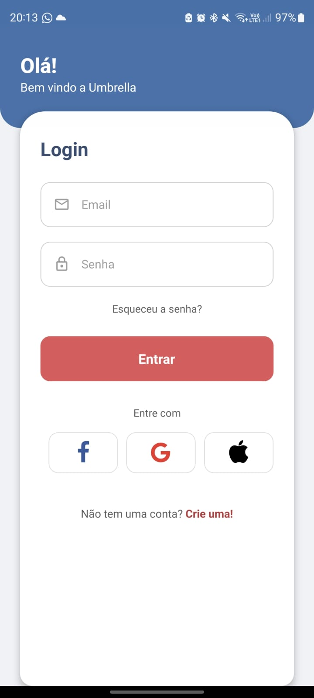
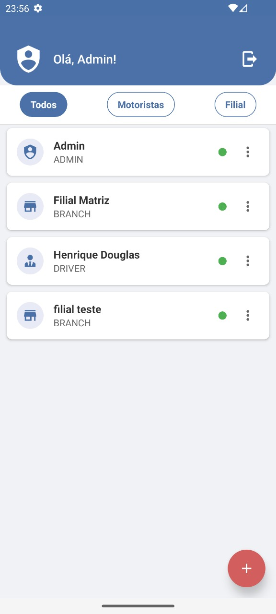
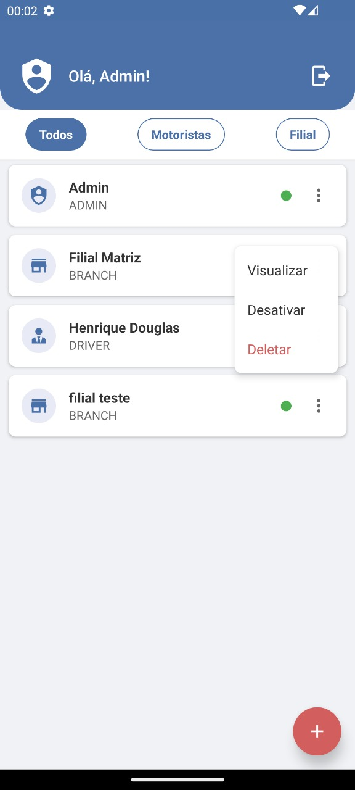
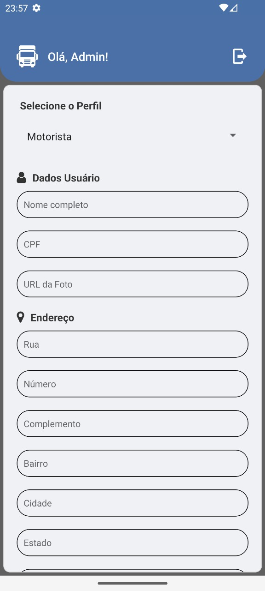
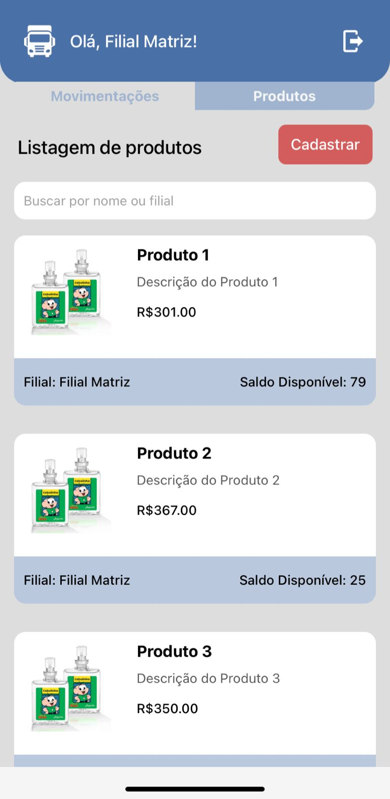
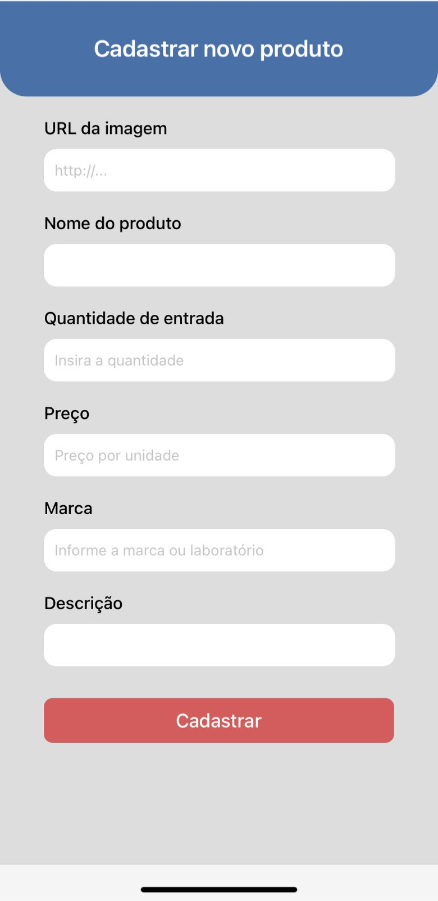
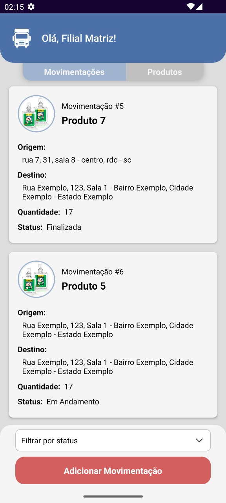
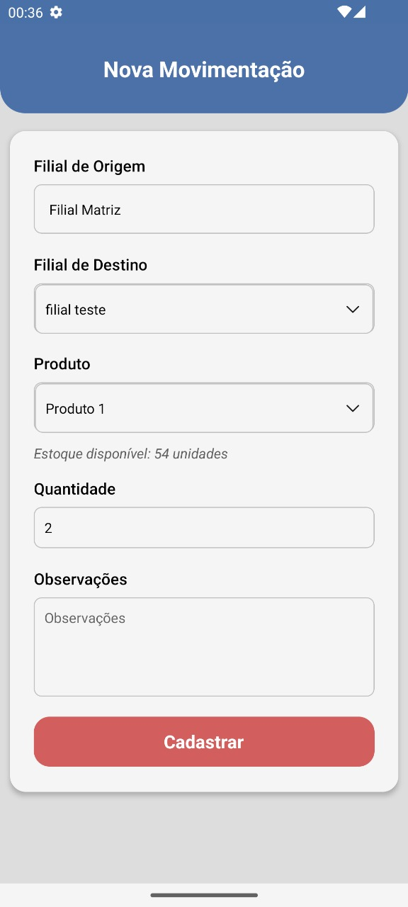
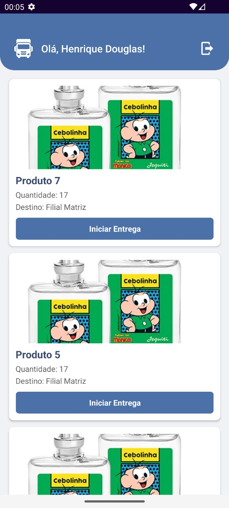

# Umbrella ☂️ - README

## Índice
- [Introdução](#introducao)
- [Funcionalidades Principais](#funcionalidades-principais)
- [Tecnologias Utilizadas](#tecnologias-utilizadas)
- [Configuração e Execução do Projeto](#configuracao-e-execucao)
- [Telas principais](#telas-principais)
- [Melhorias Futuras](#melhorias-futuras)

## <a id="introducao"></a>1. Introdução

O Aplicativo Umbrella foi desenvolvido como objetivo de otimizar o controle de movimentações de produtos entre filiais, e gerir usuários (criação de usuários, ativar e inativar). 

##  <a id="funcionalidades-principais"></a>2. Funcionalidades Principais

-  Autenticação de usuários com diferentes perfis e permissões (Admin, Filial, Motorista)
-  Gestão de usuários
-  Cadastro, listagem e transferência de produtos entre as filiais
-  Controle de estoque em tempo real por filial
-  Rastreamento completo das movimentações (Pendente/Em Progresso/Concluído)

## <a id="tecnologias-utilizadas"></a>3. Tecnologias Utilizadas

- **JavaScript (React Native)** — para a interface do usuário
- **TypeScript** — para garantir a tipagem e evitar erros

### Bibliotecas Principais:

- `@react-native-async-storage/async-storage`
- `@react-navigation/native` e `@react-navigation/stack`
- `axios` — para requisições HTTP
- `expo` e `expo-image-picker` — para funcionalidades nativas do Expo
- `react-native-picker-select` — para seleção de itens com visual personalizado

##  <a id="configuracao-e-execucao"></a>4. Configuração e Execução do Projeto

### Passo a passo:
1. Clone e rode o servidor (link abaixo):
   ```bash
   git clone https://github.com/DEVinHouse-Clamed-V3/backend-projeto-final-squad-1
   ```

2. Clone este projeto, e configure o IP do servidor no arquivo .env:
   
   ```bash
   git clone  https://github.com/DEVinHouse-Clamed-V3/frontend-projeto-final-squad-1.git
   npm install
   cp .env-example .env
   npm run start
   ```
   
4. Baixe o EXPO em seu celular, e leia o QR code que vai aparecer no terminal do front-end depois do comando 'npm run start'.

##  <a id="telas-principais"></a>5. Telas principais:
### Tela de Login


### Tela inicial no usuário de perfil Admin




### Tela de listagem e cadastro de produtos



### Tela de listagem e cadastro de movimentações



### Tela de controle de movimentações - Motoristas


##  <a id="melhorias-futuras"></a>6. Melhorias futuras:

- Modo Escuro — para melhor conforto visual em ambientes com pouca luz.
- Criar um tutorial interativo ou dicas na primeira utilização para orientar novos usuários.
- Integrar notificações push para alertar sobre estoque baixo, movimentações concluídas ou produtos próximos do vencimento.
- Integrar com impressoras Bluetooth para gerar etiquetas de produtos ou relatórios de movimentação.


## 7. Apresentação
[Link para a apresentação do projeto](https://www.canva.com/design/DAGpJ8xQ9ss/9T5y2kQWqx2I_E0IeJbggQ/edit?utm_content=DAGpJ8xQ9ss&utm_campaign=designshare&utm_medium=link2&utm_source=sharebutton)
